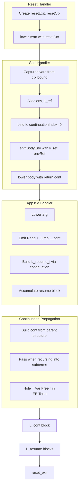

# Shift/Reset Lowering Plan

## 1. Context and Types

### 1.1 Continuation detection (no index 0 assumption)

The continuation binder `k` can be at any de Bruijn index depending on intervening bindings (e.g. `shift k -> let x = 1 in k x` puts `x` at 0, `k` at 1). Follow elaboration: when we see a shift, we know the body is `Lambda(k, e)`; we bind `k` in context as a continuation and look it up by index.

**Add to [LowerCtx](src/lowering/context.ts):**

- `continuationIndex?: number` — de Bruijn index of the continuation binder when inside a shift body. When `bind()` adds a new binder, increment: `continuationIndex: ctx.continuationIndex === undefined ? undefined : ctx.continuationIndex + 1`.

**Modify [bind()](src/lowering/context.ts):** When extending context, set `continuationIndex` in the returned ctx as above so the continuation index tracks through nested binders (Let, Lambda, etc.).

### 1.2 ShiftBodyEnv and ResetCtx

**Extend [ShiftBodyEnv](src/lowering/delimited_continuation/types.ts):**

- Add `k_ref: string` and `envRef: string` (from Alloc in Shift handler).

**Simplify [ResetCtx](src/lowering/delimited_continuation/types.ts):**

- Keep only `resetExit: string`. Remove `continuations` Map — we use `continuationIndex` + `shiftBodyEnv` for the current shift.

### 1.3 Captured vars

**Captured vars = all vars in scope at the shift point** (in the reset body), not free vars of `e`.

Example: `{ let x = 1; shift \k -> k 1; <rest> }` — captured = `[x]`. The continuation must restore `x` when it runs. Vars bound inside the shift body (e.g. in `let y = ... in k y`) are not captured — they are out of scope in the continuation.

**Implementation:** Use `ctx.bound` at the moment we lower the shift. The values (MIR var names) in `ctx.bound` are the captured vars. Build the env record from them: `{ v0: name0, v1: name1, ... }` in index order.

### 1.4 extendFree helper

**Add to [context.ts](src/lowering/context.ts):**

```ts
export const extendFree = (ctx: LowerCtx, name: string): LowerCtx => ({
  ...ctx,
  free: new Map([...ctx.free, [name, name]]),
});
```

Used when lowering the continuation term with the result var in scope (no index shifting). The "hole" in the continuation is represented as `EB.Constructors.Var({ type: "Free", name: r })` — we build an EB.Term containing that var; when we lower it with `extendFree(ctx, r)`, it resolves to the MIR var.

---

## 2. lower signature and continuation parameter

**Update [lower](src/lowering/lower.ts) signature:**

```ts
export function lower(
  term: EB.Term,
  ctx: LowerCtx,
  continuation?: (result: string) => LowerResult,
): LowerResult;
```

**Continuation type:** `(r: string) => LowerResult`. It either (a) directly returns a LowerResult (e.g. shift body return: `(r) => ({ instrs: [], value: r, functions: [], terminator: Jump(reset_exit, [r]) })`), or (b) calls `lower(continuationTerm(r), extendFree(ctx, r))` and returns that (e.g. App case: `(r) => lower(App(f, Var(Free(r))), extendFree(ctx, r))`).

**Post-match logic:** After the match yields a result, only call the continuation when we have a **normal** result (no terminator). When we hit `k(v)`, we return early with `terminator`; the continuation is used inside the k(v) handler to build the resume block, not in the post-match.

```ts
return continuation && !result.terminator
  ? merge(result, continuation(result.value))
  : result;
```

Where `merge` combines `result.instrs` with `continuation(result.value).instrs` and uses the terminator/value from the continuation result.

---

## 3. Continuation propagation: why and how

**Why:** When we hit `k(v)`, we need to build the resume block. The resume block runs "what happens after k(v) returns". That is the continuation. We obtain it from the parent by passing it when we recurse.

**How:** The continuation is derived from the **parent expression structure**, before we know if the subterm will produce a value or jump. For `App(add, k 1)`, the continuation of the first arg is `(r) => App(add, r)` — we build it from the App shape. We pass it when we call `lower(k 1, ctx, cont)`. When we recurse and hit `k(v)`, we use that same continuation to build the resume block.

**The "hole":** We represent the result position as `EB.Constructors.Var({ type: "Free", name: r })`. We construct an EB.Term (e.g. `App(add, Var(Free(r)))`). When we lower it with `extendFree(ctx, r)`, the Var resolves to the MIR var. So we build a term, not a string.

**All compound cases must be updated** to build and pass continuations when recursing:


| Case              | When lowering               | Continuation                                                                                            |
| ----------------- | --------------------------- | ------------------------------------------------------------------------------------------------------- |
| **App(f, arg)**   | `arg`                       | `(r) => lower(App(f, Var(Free(r))), extendFree(ctx, r), continuation)` — pass continuation for nested k |
| **App(f, arg)**   | `f` (when f is curried App) | `(r) => lower(App(Var(Free(r)), arg), extendFree(ctx, r), continuation)`                                |
| **StructApp**     | each field                  | `(r) => lower(App(Struct, RowWithFieldReplaced(label, r)), extendFree(ctx, r))`                         |
| **Proj**          | `term`                      | `(r) => lower(Proj(label, Var(Free(r))), extendFree(ctx, r))`                                           |
| **Inj**           | `value`, `term`             | per-subterm as needed                                                                                   |
| **Primitive App** | each arg                    | build rest of prim app with this arg's result                                                           |


**Lambda:** No continuation for the body. Do increment `continuationIndex` via `bind`.

**Match in shift body:** Deferred for v1 — throw or document as unsupported.

---

## 4. Patterns

**Add to [patterns.ts](src/lowering/patterns.ts):**

```ts
Reset: { type: "Reset" } as const,
Shift: { type: "Shift" } as const,
```

---

## 5. Reset case

**Add to lower.ts match (before .otherwise):**

```ts
.with(Patterns.Reset, ({ term }) => {
  const resetExit = ctx.nextLabel();
  const resetCtx: ResetCtx = { resetExit };
  return lower(term, { ...ctx, resetCtx });
})
```

Throw if `!ctx.resetCtx` when we hit a Shift (shift without enclosing reset).

---

## 6. Shift case

**Add to lower.ts match.** Extract handler to `lowerShift` in [delimited_continuation/handler.ts](src/lowering/delimited_continuation/) (new file). The handler:

1. Require `ctx.resetCtx`; else throw "Shift without enclosing reset".
2. Unwrap `body` as `Lambda(k, e)` (body is `Abs` with `Lambda` binding).
3. **Captured vars:** Use `ctx.bound` at the shift point (vars in scope in the reset body). Alloc env record `{ v0, v1, ... }`, alloc `k_ref` with `__env: envRef`.
4. Build inner ctx: `bind(ctx, k)` and set `continuationIndex: 0` (k is at 0).
5. Build `shiftBodyEnv`: `{ L_cont_label, nextIndex, resumeBlocks, k_ref, envRef }`.
6. Call `lower(e, innerCtx, cont)` where `cont` is the shift body's **return continuation** — the final step when the body completes without resuming: `(r) => ({ instrs: [], value: r, functions: [], terminator: Jump(reset_exit, [r]) })`. No recursive `lower`; we jump directly to reset_exit.
7. Build `L_cont` block: params `[v, envRef, resume_idx]`. **Traversal order:** The continuation (rest of reset) is traversed **when we build L_cont**, after we have finished traversing the shift body. Lower the continuation with `v` in scope to produce the L_cont body. Terminator: `Branch(resume_idx, cases)` — `resume_idx` selects which `L_resume_i` to jump to with the result.
8. Wire: shift_body block → Jump L_cont; L_cont → L_resume_i; L_resume_i → L_cont or reset_exit.
9. Return `{ blocks, entry, value: mergeParam }` (or equivalent for block-graph).

---

## 7. App case: continuation call detection and handling

**Before normal App handling**, detect `App(k, v)` where `k` is the continuation:

- `func` is `Var(Bound i)` and `i === ctx.continuationIndex` and `ctx.shiftBodyEnv` is set.

**When detected:**

1. Require `continuation`; else throw "k(v) in invalid context".
2. Lower `arg` to get `v` (MIR var).
3. `resume_idx = ctx.shiftBodyEnv.nextIndex()`.
4. Emit `Read("__env", k_ref, envRef)` and `Jump L_cont(v, envRef, resume_idx)`.
5. Create resume block `L_resume_i(resultVar)`:
  - `ctx_resume = extendFree(ctx, resultVar)`.
  - `bodyResult = continuation(resultVar)` — calls `lower(App(f, Var(Free(resultVar))), extendFree(ctx, resultVar), continuation)` for nested k support.
  - Block = `Block(L_resume_i, [resultVar], bodyResult.instrs, bodyResult.terminator ?? Return(bodyResult.value))`.
6. Append block to `ctx.shiftBodyEnv.resumeBlocks`.
7. Return `{ terminator: Jump(...), blocks: [...], entry, value }` so the caller propagates.

**Propagate terminator:** In App (and other cases that recurse), keep `if (result.terminator) return result` so k(v) results bubble up.

---

## 8. Flow example: `add(k 1, k 2)` in shift body

Assume shift body is `add(k 1, k 2)` (curried as `App(App(add, k 1), k 2)`). We are inside the shift with `shiftBodyEnv` and `continuationIndex` set.

```
Step 1: Enter App(App(add, k 1), k 2)
  func = App(add, k 1), arg = k 2
  Lower func first.

Step 2: Recurse into App(add, k 1)
  func = add, arg = k 1
  Continuation for arg: (r) => lower(App(add, Var(Free(r))), extendFree(ctx, r))
  Call: lower(k 1, ctx, cont)

Step 3: Match on k 1 = App(k, 1)
  Detect continuation call (func is k, shiftBodyEnv set)
  Continuation present: (r) => App(add, r)

Step 4: Handle k(1)
  - Lower arg = 1 → v1
  - resume_idx = 0
  - Emit Read + Jump L_cont(v1, envRef, 0)
  - Build L_resume_0(resultVar): lower cont(resultVar) = App(add, Var(Free(resultVar)))
  - Append L_resume_0 to resumeBlocks
  - Return { terminator, blocks, ... }

Step 5: In L_resume_0, we lower App(add, resultVar)
  - Lower add → closure, lower Var(Free(resultVar)) → resultVar
  - Emit Call(closure, [env, resultVar], add_result)
  - This block continues with add(add_result, k 2)...

Step 6: Lower App(App(add, resultVar), k 2) in resume block
  - func = App(add, resultVar), arg = k 2
  - Continuation for arg: (r) => lower(App(App(add, resultVar), Var(Free(r))), extendFree(ctx_resume, r))
  - Call: lower(k 2, ctx_resume, cont)

Step 7: Match on k 2 = App(k, 2)
  - Detect continuation call
  - Build L_resume_1(resultVar2): lower add(add_result, resultVar2) → final result
  - Append L_resume_1, return with terminator

Step 8: Summary
  Shift body: add(k 1, k 2)
    → lower add → closure
    → lower k 1 with cont = (r) => add(r, k 2)
       → k(1): emit Jump L_cont(1, env, 0)
       → build L_resume_0: lower add(resultVar, k 2)
          → lower add(resultVar) → add_result
          → lower k 2 with cont = (r2) => add(add_result, r2)
             → k(2): emit Jump L_cont(2, env, 1)
             → build L_resume_1: lower add(add_result, resultVar2) → final
    → return blocks + terminator
```

---

## 9. lowerToMir and terminator handling

When `lower` returns `result.terminator` and `result.blocks`, `lowerToMir` must build the function from blocks. The existing logic already handles `result.blocks` and `result.entry`; ensure the block that ends with the terminator is included and the entry/block graph is consistent.

---

## 10. Update all relevant documentation

- **[docs/MIR-LOWERING.md](docs/MIR-LOWERING.md):**
  - §7.4: Update algorithm sketch with continuation parameter, `continuationIndex`, `extendFree`, captured vars from ctx.bound.
  - §7.3.2: Clarify that `continuationIndex` is used and we bind k in context like elaboration.
  - §5 Implementation Status: Mark Reset/Shift as implemented; note v1 limitations (no Match in shift body).
  - §8.1 or new subsection: Add **k aliasing and escape** notes (see below).
- **[AGENTS.md](AGENTS.md):** Ensure shift/reset lowering is accurately described.
- **[docs/KNOWN-DOC-ISSUES.md](docs/KNOWN-DOC-ISSUES.md):** Add v1 limitations (Match in shift body, Block/Let in shift body if deferred); add k aliasing limitation.
- **Cursor rules / copilot-instructions:** No changes unless they explicitly mention shift/reset.

### 10.1 k aliasing, resume syntax, and escape analysis (documentation content)

**Source syntax verification:** Both Nearley and tree-sitter support k aliasing. Example: `shift \k -> { let f = k; return (f 1, f 2) }` is valid in both grammars — the shift body can be a block with a let that binds k to f, then uses f. No discrepancy between parsers.

**Lowering limitation:** We only detect continuation calls when `func` is `Var(Bound continuationIndex)` (direct k). We do not support indirect use via aliases (e.g. `let f = k in f 1`). Such terms would be lowered as normal closure calls and produce incorrect code. This is an escape/alias analysis problem; see MIR-LOWERING.md §8.1.

**resume is not bindable:** The surface syntax has `resume` as a keyword (`resume <expr>`), not a first-class value. We cannot write `let f = resume in f 1`. Elaboration turns `resume v` into `App(k, v)`, so the elaborated core always has direct k calls when using the resume keyword. This simplifies lowering for the common case.

**What to document:**

- Lowering assumes k is used only in direct calls `App(k, v)`. Aliasing (`let f = k in f 1`) is not supported; would require escape/alias analysis (deferred).
- Surface syntax: `resume` is a keyword and cannot be bound, which avoids the "bind resume" case. However, `let f = k` in the shift body is valid syntax and would produce unsupported elaborated core — document as a limitation.
- Add to MIR-LOWERING.md §8.1 and KNOWN-DOC-ISSUES.md for future reference when implementing escape analysis.

---

## Flow diagram




---

## Implementation order

**Note:** Do not verify tests during implementation. Testing is the final step (step 9); proceed through steps 1–8 without running or fixing tests. Stop after completing each step for review.

1. Context: `continuationIndex`, `extendFree`, `bind` update, `ShiftBodyEnv`/`ResetCtx` changes.
2. Patterns: `Reset`, `Shift`.
3. `lower` signature and continuation parameter; post-match logic (only when `!result.terminator`); `merge` helper.
4. Reset case.
5. Shift case (handler in `delimited_continuation/handler.ts`).
6. App case: k(v) detection and handling.
7. **All compound cases:** App, StructApp, Proj, Inj, Primitive App — add continuation propagation.
8. Documentation updates — including §10.1 (k aliasing, resume syntax, escape analysis) in MIR-LOWERING.md and KNOWN-DOC-ISSUES.md.
9. **Tests (final step):** basic shift/reset, multi-shot, shift without resume. Defer test verification until all implementation steps are complete.

